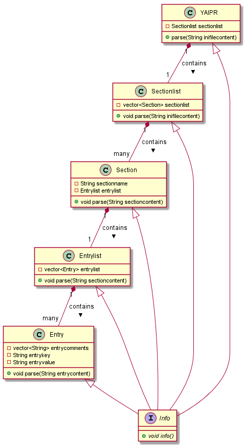

# YAIPR

YAIPR stands for *Y*et *A*nother *I*ni *P*arser in *R*ust.

I've alread created an Ini-Parser called [YAIP]. The basic structure of [YAIP]
does not allow multi-line values at the moment. Additional the C DLL interface
is missing. And there at least some convenience features like templates which
bloated the code.

*YAIPR* is designed to be the plain ini file parser.

## Motivation

Learn how to use [Rust] as programming language. Sting parsing in C/C++ is
still somehow unconvenient. Trying to move this part to an infrastructure/
language with a little bit more comfort. Also Rust seems to be more reliable
for... I don't know exactly. 8-)

## Architecture

The planned architecture is shown here:



Info will be somehow an interface - in Rust it's trait. This is implemented
for debugging reasons.

The architecuture is currently for parsing only. We need to extend the
architecuture for

- C interface
  - Get a list of section names
  - Get a list of entry names for given section
  - Read a value for given section/key pair
  - Get a list of comments for given section/key pair
  - Add a new comment for given section/key pair
  - Write a value for given section/key pair
  - Delete an entry for given section/key
  - Delete a section for given section
  - Get ini data as one string

## Behaviour

The complete ini file content will be thrown into the `parse` method of `YAIPR`.
This is a simple redirect to the parse method of `Sectionlist`. Here the ini
file content is parsed into string slices for a complete section. For each slice
a `Section` is created and the slice is passed to the `parse` method there,
parsing the name of the section. Also an `Entrylist` is created, and the parse
method there is executed with the slice of the section to parse all entries.
Each `Entry` has a list of comments, the lines before the key/value entry, a key
and of course a value.

## Regular expressions

A [regular expression](regex) is very powerful. These concepts are already used
in [YAIP] - and so they will be used also in YAIPR.

- The [regex] for determining a full section:

```text
(?ms)(?P<SEC_FULL>^\[[^\[]*)
 \-/  \----------/\-/\---/^
  |        |       |   |  |
  |        |       |   |  +--- 0 or many times
  |        |       |   +------ Match all until next [ is found or end of string
  |        |       +---------- Line starts with [
  |        +------------------ Name group SEC_FULL
  +--------------------------- Multi-line match
```

- The [regex] for determining a section name:

```text
(^\[(?P<SEC_NAME>.*)\])
 \-/ \----------/\/ \/
  |        |      |  |
  |        |      |  +--- Pattern ends with ]
  |        |      +------ Match everything until ] appears
  |        +------------- Name group SEC_NAME
  +---------------------- Line starts with [
```

## To Do's

- Make myself familiar with tests for Rust (how to write tests in Rust).
- Make myself familiar with using a DLL inside Rust (may be part of the first point).
- Make myself familiar with using a DLL inside C++, for more details see here: [FFI].

## To think about

- The C interface should be planned accurate.
- How to delete comments? Should be done manually by editing the ini file.

[FFI]: https://doc.rust-lang.org/nomicon/ffi.html
[regex]: https://en.wikipedia.org/wiki/Regular_expression
[Rust]: https://www.rust-lang.org/
[YAIP]: https://github.com/ThirtySomething/YAIP
